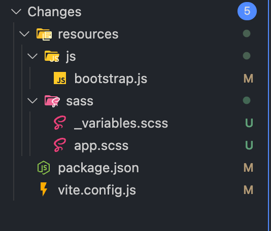
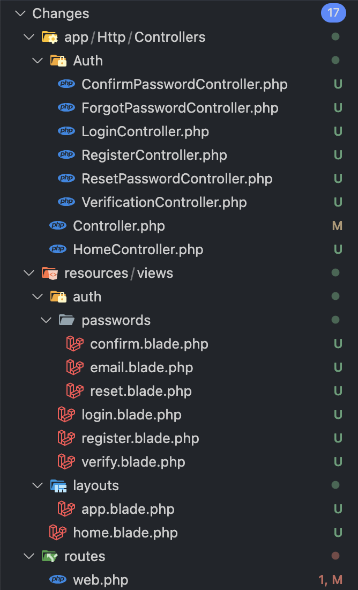

## Authentication (Xác thực trong Laravel)

## `Auth::routes(['register'=>false]);`

### **1. `Auth::routes()` là gì?**

- Đây là một helper function trong Laravel được sử dụng để tạo nhanh các route liên quan đến quá trình xác thực người dùng (authentication).
- Khi gọi hàm này, Laravel sẽ tự động tạo ra các route cho các chức năng phổ biến như: đăng nhập, đăng ký, đăng xuất, xác thực email, quên mật khẩu, v.v.
- Nếu bạn thêm dòng code `Auth::routes()` vào file `routes/web.php` của Laravel, thì ứng dụng của bạn sẽ có các route sau:

| Route                   | Tính năng                                | Method | Route Name          | Controller@function                               | Model    | View                 |
| ----------------------- | ---------------------------------------- | ------ | ------------------- | ------------------------------------------------- | -------- | -------------------- |
| /login                  | Hiển thị form đăng nhập                  | GET    | login               | Auth\LoginController@showLoginForm                | App\User | auth.login           |
| /logout                 | Đăng xuất khỏi hệ thống                  | POST   | logout              | Auth\LoginController@logout                       | App\User |                      |
| /register               | Hiển thị form đăng ký                    | GET    | register            | Auth\RegisterController@showRegistrationForm      | App\User | auth.register        |
| /password/reset         | Hiển thị form yêu cầu đặt lại mật khẩu   | GET    | password.request    | Auth\ForgotPasswordController@showLinkRequestForm | App\User | auth.passwords.email |
| /password/email         | Gửi email đặt lại mật khẩu               | POST   | password.email      | Auth\ForgotPasswordController@sendResetLinkEmail  | App\User |                      |
| /password/reset/{token} | Hiển thị form đặt lại mật khẩu với token | POST   | password.update     | Auth\ResetPasswordController@reset                | App\User | auth.passwords.reset |
| /email/verify           | Hiển thị thông báo xác thực email        | GET    | verification.notice | Auth\VerificationController@show                  | App\User | auth.verify          |
| /email/verify/resend    | Gửi lại email xác thực                   | POST   | verification.resend | Auth\VerificationController@resend                | App\User |                      |

### **2. `['register'=>false]` có ý nghĩa gì?**

Nếu bạn đọc thử khai báo của hàm `Auth::routes()` bạn sẽ thấy nó có thể nhận vào một mảng tên `$options`. Đây chính là mảng cho phép bạn truyền vào các options cấu hình mong muốn


Với hàm `Auth::routes()` nó tự động cấu hình nhiều `route` sẵn có, nếu bạn không muốn dùng route nào trong danh sách này bạn có thể loại trừ chúng bằng cách truyền vào một mảng options

```php
$options = [
    'route không sử dụng 1' => false,
    'route không sử dụng 2' => false,
    //...
];
Auth::routes($options);
```

Ở đây chúng ta loại bỏ chỉ route register không sử dụng nên đã truyền thẳng vào hàm Auth::routes.

### **Model, View, Controller trong Auth**

Như chúng ta đã biệt việc vận hành cơ bản của một tính năng trong laravel sẽ dựa trên các thành phần của MVC và Route gồm: Model, View, Controller và cách điều hướng cho Route cho các thành phần trên. `Auth::routes()` đã khai báo sẵn các bộ route trên, lúc này bạn có 2 lựa chọn

- Lựa chọn 1: Bạn có thể tự khai báo các function và class còn thiếu theo quy tắc dẫn route có sẵn theo nguyên tắc của `Auth::routes()`.
- Lựa chọn 2: Bạn có thể tạo ra chúng tự động thông qua các lệnh và gói cài đặt cho laravel hỗ trợ.

Dưới đây là các bước vận hành của lựa chọn 2.

Hiện tại laravel hỗ trợ chúng ta nhiều view khác nhau như: vue, react, bootstrap. Trong phần này sẽ hướng dẫn thao tác với view là bootstrap, các view khác bạn có thể tham khảo [tài liệu chính thức](https://laravel.com/docs/6.x/frontend) và thực hiện tương tự

Việc cài đặt view bootstrap sẽ thực hiện qua các bước sau:

- **Cài đặt laravel/ui mới nhất**
  Chạy lệnh `composer require laravel/ui --dev`

  Sau khi thêm gói `laravel/ui` bạn có thể sử dụng các lệnh sau:

  ```shell
    // Generate basic scaffolding...
    php artisan ui bootstrap
    php artisan ui vue
    php artisan ui react
    // Generate login / registration scaffolding...

    php artisan ui bootstrap --auth
    php artisan ui vue --auth
    php artisan ui react --auth
  ```

- **Cài đặt bootstrap**

  - Để tạo view cho ví dụ này chúng ta dùng bootstrap.

  ```shell
  php artisan ui bootstrap
  ```

  - Sau khi thực hiện lệnh bạn sẽ thấy có một số file có sự thay đổi và xuất hiện thêm các file mới. Lý do là sau khi thực thi lệnh laravel sẽ tiến hành cài đặt bootstrap vào dự án.
    
  - Tiếp theo bạn cần cài đặt npm và chạy lệnh build các gói css và js

  ```shell
  npm i
  npm run build
  ```

  > Nếu bạn chưa cài npm và node thì hãy cài đặt node phiên bản tương ứng với laravel mà bạn sử dụng.
  > Lưu ý nếu quên chạy lệnh build bạn sẽ gặp lỗi sau: `Vite manifest not found at: <path ....>/public/build/manifest.json`

- **Tạo View và Controller**

  - Tiếp theo bạn chạy lệnh `php artisan ui bootstrap --auth`. Lệnh này sẽ tạo ra các View và Controller.
  - Mặc định màn hình câu lệnh sẽ hỏi chúng ta câu hỏi sau: `The [Controller.php] file already exists. Do you want to replace it? (yes/no) [yes]`. Nếu trong Controller gốc của bạn có các xử lý do bạn viết thì lúc này bạn cần backup chúng trước khi thực hiện, vì laravel sẽ ghi đè file này.
  - Sau khi các thao tác nào được tạo bạn sẽ có được bộ View và Controller sẵn. Việc tiếp theo chúng ta cần làm là xử lý Model.
    

- **Tạo Model**

  - Tiếp tục kiểm tra lại bạn sẽ thấy file `app/Models/User.php`:

  ```php
  namespace App\Models;

  // use Illuminate\Contracts\Auth\MustVerifyEmail;
  use Illuminate\Database\Eloquent\Factories\HasFactory;
  use Illuminate\Foundation\Auth\User as Authenticatable;
  use Illuminate\Notifications\Notifiable;

  class User extends Authenticatable
  {
  use HasFactory, Notifiable;

      /**
       * The attributes that are mass assignable.
       *
       * @var array<int, string>
       */
      protected $fillable = [
          'name',
          'email',
          'password',
      ];

      /**
       * The attributes that should be hidden for serialization.
       *
       * @var array<int, string>
       */
      protected $hidden = [
          'password',
          'remember_token',
      ];

      /**
       * Get the attributes that should be cast.
       *
       * @return array<string, string>
       */
      protected function casts(): array
      {
          return [
              'email_verified_at' => 'datetime',
              'password' => 'hashed',
          ];
      }

  }
  ```

  - Mặc định laravel sẽ sử dụng dữ liệu trong bảng `users` kết nối với model User để xử lý đăng nhập.
  - Các trường mặc định bạn cần có là name, email và password
  - Trong model này bạn sẽ thấy rằng `User` model đang extends `Authenticatable`. Đây là model hỗ trợ xử lý đăng nhập, nếu bạn muốn sử dụng một model khác với model User bạn có thể sử dụng extends `Authenticatable` cho model đó.

- **Sau khi thực hiện các thao tác trên bạn có thể thử sử dụng các trang Auth do laravel tạo ra. Ngoài ra bạn cũng có thể custom từng chức năng theo ý của bạn.**
