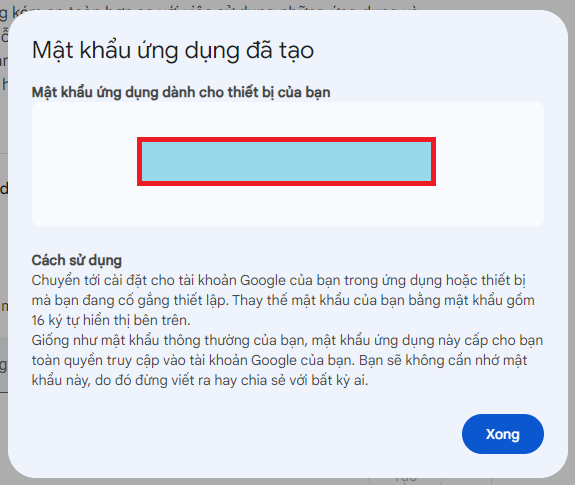

## Hướng dẫn tạo mật khẩu ứng dụng mới cho Gmail

**Mật khẩu ứng dụng** là một loại mật khẩu đặc biệt được tạo ra để sử dụng cho các ứng dụng bên thứ ba muốn truy cập vào tài khoản Google của bạn. Nó giúp tăng cường bảo mật cho tài khoản của bạn bằng cách tạo ra một lớp bảo vệ bổ sung.

**Tại sao cần tạo mật khẩu ứng dụng?**

- **Bảo mật:** Ngăn chặn truy cập trái phép vào tài khoản Google của bạn.
- **Tiện lợi:** Sử dụng cho các ứng dụng, dịch vụ cần đăng nhập bằng tài khoản Google mà không cần nhập mật khẩu chính.

**Hướng dẫn chi tiết:**

1. **Đăng nhập vào tài khoản Google:** Truy cập [https://myaccount.google.com/apppasswords](https://myaccount.google.com/apppasswords) và đăng nhập bằng tài khoản Gmail của bạn.
2. Nhập tên ứng dụng: Ex: "Test App", sau đó ấn "Tạo".
3. Sau khi tọa màn hính sẽ hiển thị mật khẩu ứng dụng cho bạn, hãy lưu lại mật khẩu này.
   

**Lưu ý quan trọng:**

- **Mỗi ứng dụng cần một mật khẩu riêng:** Nếu bạn muốn sử dụng nhiều ứng dụng khác nhau với cùng một tài khoản Google, bạn cần tạo một mật khẩu ứng dụng riêng cho từng ứng dụng.
- **Bảo mật mật khẩu:** Đừng chia sẻ mật khẩu ứng dụng với bất kỳ ai.
- **Xóa mật khẩu ứng dụng:** Nếu bạn không còn sử dụng một ứng dụng nào đó, hãy xóa mật khẩu ứng dụng tương ứng để tăng cường bảo mật.
