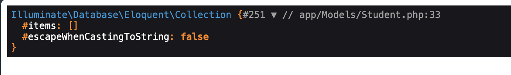
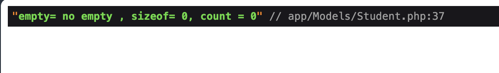

Tuyệt vời! Hãy cùng tìm hiểu sâu hơn về hai hàm `count()` và `sizeof()` trong PHP, đặc biệt là khi sử dụng trong Laravel.

## Hàm `count()` và `sizeof()` trong PHP (Laravel)

**Mục đích:**

- **Đếm số lượng phần tử:** Cả hai hàm này đều được sử dụng để đếm số lượng phần tử trong một mảng hoặc một đối tượng có thể đếm được (ví dụ như một chuỗi).

**Cú pháp:**

```php
count($array);
sizeof($array);
```

**Sự khác biệt:**

Về cơ bản, `count()` và `sizeof()` là đồng nghĩa với nhau. Chúng thực hiện cùng một chức năng và thường có thể thay thế cho nhau. Tuy nhiên, có một số điểm nhỏ cần lưu ý:

- **Hiệu suất:** Trong hầu hết các trường hợp, hiệu suất của hai hàm này là tương đương nhau. Tuy nhiên, trong một số tình huống đặc biệt, `count()` có thể hơi nhanh hơn một chút.
- **Sử dụng phổ biến:** `count()` được sử dụng phổ biến hơn trong cộng đồng PHP.

**Ví dụ:**

```php
$numbers = [1, 2, 3, 4, 5];
$count = count($numbers); // hoặc sizeof($numbers)
echo "Mảng có $count phần tử";
```

**Truyền tham số thứ hai:**

Cả hai hàm `count()` và `sizeof()` đều có thể nhận một tham số thứ hai để chỉ định cách đếm:

- **`COUNT_NORMAL` (0):** Đếm các phần tử ở cấp độ hiện tại (mặc định).
- **`COUNT_RECURSIVE` (1):** Đếm đệ quy các phần tử trong mảng đa chiều.

```php
$multidimensionalArray = [
    [1, 2],
    [3, 4, 5],
];

// Đếm các phần tử ở cấp độ đầu tiên
$count1 = count($multidimensionalArray); // Kết quả: 2

// Đếm đệ quy tất cả các phần tử
$count2 = count($multidimensionalArray, COUNT_RECURSIVE); // Kết quả: 5
```

### Lưu ý

Việc sử dụng `count()` và `sizeof()` để kiểm tra kết quả của model trên Laravel là chính xác hơn việc sử dụng hàm empty. Lý do là vì empty không kiểm tra được số lượng phần tử trong collect. Chỉ cần collect không rỗng thì empty sẽ trả về false.

Ví dụ: Khi ta `dd()` dữ liệu của hàm sau trong trường hợp nó bị lỗi dữ liệu ta sẽ thấy kết quả sau:

```php
public static function search(string | null $search)
{
    $students = Student
        ::join('classes', 'students.class_id', '=', 'classes.class_id')
        ->where("students.student_name", "=", "%" . $search . "%")
        ->orWhere("classes.class_name", "=", "%" . $search . "%")
        ->select('students.*', 'classes.class_name')
        ->get();
    dd($students);
    return $students;
}
```



Thử dùng hàm `empty()` và `sizeof()`, `count()` để kiểm tra:

```php
public static function search(string | null $search)
{
    $students = Student
        ::join('classes', 'students.class_id', '=', 'classes.class_id')
        ->where("students.student_name", "=", "%" . $search . "%")
        ->orWhere("classes.class_name", "=", "%" . $search . "%")
        ->select('students.*', 'classes.class_name')
        ->get();
    $empty = empty($students) ? 'empty' : 'no empty';
    $sizeof = sizeof($students);
    $count = count($students);
    dd("empty= $empty , sizeof= $sizeof, count = $count");

    return $students;
}
```



Lý do empty không trả về true là do object không phải là đối tượng rỗ vì chỉ có items là rỗng
