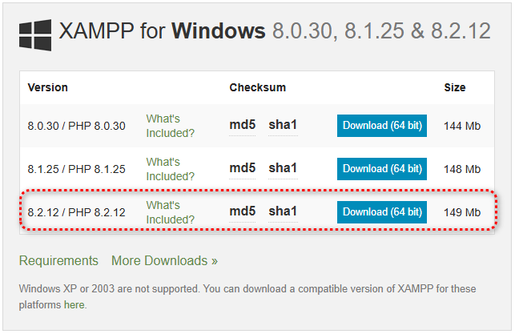
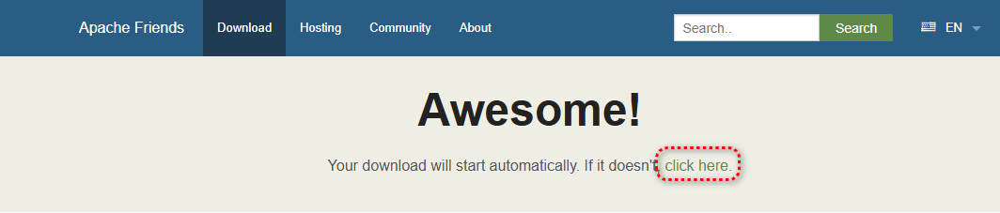
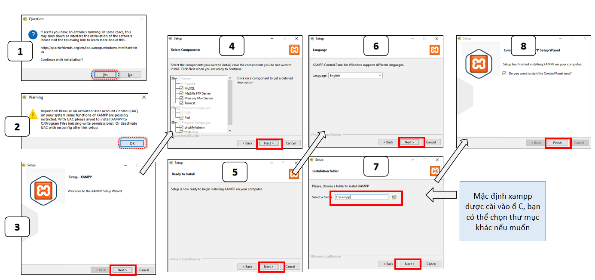
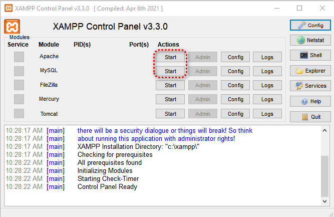
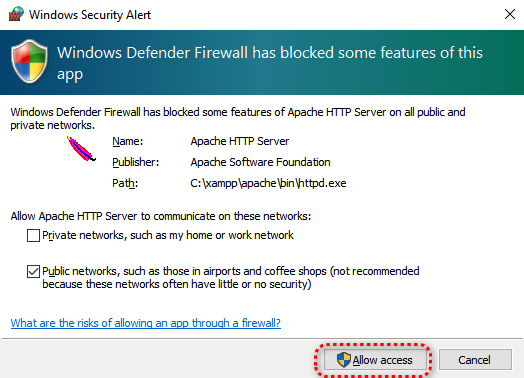
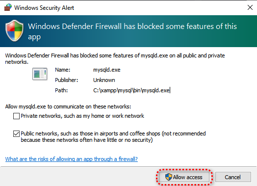
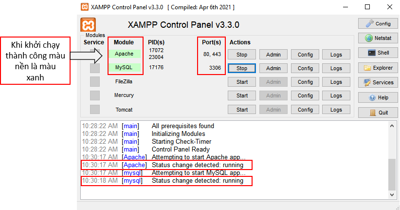
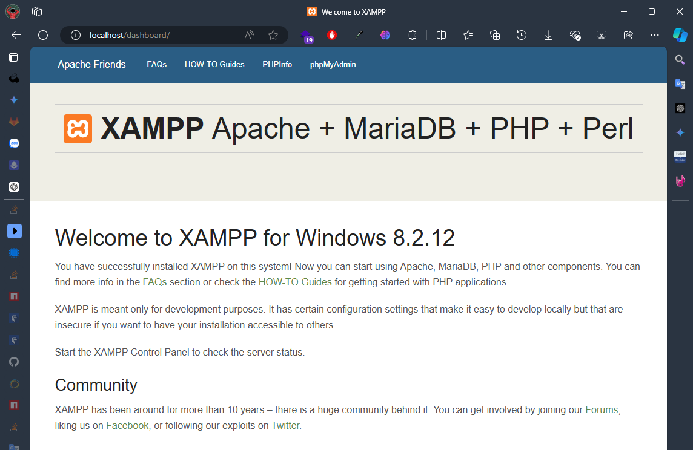
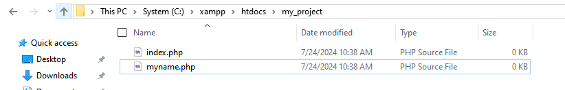
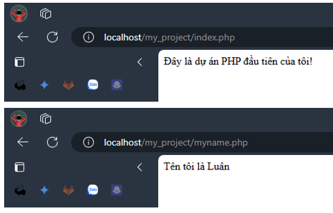

## Hướng dẫn cài đặt XAMPP và chạy dự án PHP đầu tiên cho sinh viên

**Giới thiệu:**

Chào các bạn sinh viên! Trong bài hướng dẫn này, tôi sẽ hướng dẫn các bạn cách cài đặt XAMPP và chạy dự án PHP đầu tiên trên máy tính của mình. XAMPP là một gói phần mềm miễn phí và dễ sử dụng, cung cấp môi trường máy chủ web hoàn chỉnh cho phép bạn phát triển và thử nghiệm các ứng dụng web PHP.

**Bước 1: Tải xuống XAMPP**

1. Truy cập trang web chính thức của XAMPP: [https://www.apachefriends.org/download.html](https://www.apachefriends.org/download.html)
1. Chọn phiên bản XAMPP phù hợp với hệ điều hành của bạn (Windows, macOS hoặc Linux). Ở môn học này chúng ta sẽ sử dụng phiên bản XAMPP với PHP 8.2.12
   
1. Nhấp vào nút "Tải xuống" để tải tệp cài đặt XAMPP. Trong trường hợp tải về mà không thấy file bạn có thể chọn dòng này để download lại.
   

**Bước 2: Cài đặt XAMPP**

1. Chạy tệp cài đặt XAMPP đã tải xuống.
1. Làm theo hướng dẫn cài đặt trên màn hình. Chọn các thành phần bạn muốn cài đặt (khuyến nghị chọn tất cả).
1. Nhấp vào nút "Cài đặt" để bắt đầu cài đặt XAMPP.
1. Sau khi cài đặt hoàn tất, hãy nhấp vào nút "Hoàn tất".
   

**Bước 3: Khởi động XAMPP**

1. Mở bảng điều khiển XAMPP.
1. Nhấp vào nút "Khởi động" cho các dịch vụ sau:
   _ Apache
   _ MySQL
   
   
   
1. Đảm bảo rằng các dịch vụ này hiển thị trạng thái "Đang chạy".
   

**Bước 4: Kiểm tra cài đặt**

1. Mở trình duyệt web của bạn.
1. Nhập địa chỉ sau vào thanh địa chỉ: `http://localhost/`
1. Nếu trang web XAMPP hiển thị thành công, nghĩa là bạn đã cài đặt XAMPP thành công.
   

**Bước 5: Chạy dự án PHP đầu tiên**

1. Tạo một thư mục mới trên máy tính của bạn để lưu trữ dự án PHP của bạn. Ví dụ: `C:\xampp\htdocs\my_project`.
1. Mở Notepad hoặc trình soạn thảo văn bản yêu thích của bạn.
1. Tạo một 2 mới với tên `index.php` và `myname.php` và lưu nó vào thư mục my_project.
1. Các phần code dưới đây được lưu ở thư mục `source/task1/my_project` của dự án này trên github bạn có thể copy để vào XAMPP và chạy thử hoặc tự gõ lệnh để dễ nhớ.
   
1. Thêm code PHP sau vào tệp `index.php`:

```php
<?php
  echo "Đây là dự án PHP đầu tiên của tôi!";
?>
```

1. Thêm code PHP sau vào tệp `myname.php`:

```php
<?php
  echo "Tên tôi là ....";
?>
```

1. Lưu tệp `index.php` và `myname.php`.
1. Mở trình duyệt web của bạn.
1. Nhập địa chỉ sau vào thanh địa chỉ: `http://localhost/my_project/index.php` và `http://localhost/my_project/myname.php`
1. Trang web sẽ hiển thị văn bản bạn vừa nhập.
   

> Lưu ý thêm: Với các file có tên là index.php bạn chỉ cần nhập đến tên thư mục chứa nó, file index.php bên trong thư mục đó sẽ tự chạy. Ví dụ nếu bạn vào đường link `http://localhost/my_project/` thì sẽ có kết quả tương tự `http://localhost/my_project/index.php`
> **Chúc mừng bạn đã hoàn thành cài đặt XAMPP và chạy dự án PHP đầu tiên!**

**Lưu ý:**

- Bạn có thể thay đổi code PHP trong tệp `index.php` để tạo các trang web phức tạp hơn.
- Tham khảo tài liệu XAMPP để biết thêm thông tin về cách sử dụng các tính năng khác nhau của XAMPP: [https://www.apachefriends.org/docs/](https://www.apachefriends.org/docs/)
- Hãy hỏi tôi nếu bạn gặp bất kỳ vấn đề nào trong quá trình cài đặt hoặc sử dụng XAMPP.

**Ngoài ra:**

- Bạn có thể sử dụng các công cụ chỉnh sửa code PHP chuyên dụng như Sublime Text, Visual Studio Code hoặc PHPStorm để viết và chỉnh sửa code PHP dễ dàng hơn.

**Chúc các bạn học tập và thành công!**
