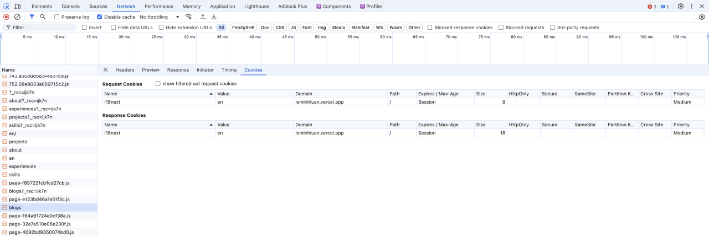

### **What is a cookie?** (Cookie là gì?)

**Cookie** (hay còn gọi là **HTTP cookie, web cookie, Internet cookie, cookie trình duyệt**) là những chuỗi từ một trang web gửi đến máy người dùng và được lưu lại thông qua trình duyệt khi người dùng truy cập trang web đó. Mỗi khi người dùng truy cập lại website đó, trình duyệt sẽ gửi cookie trở lại server.

Về cơ bản cookie có thể được phân làm hai loại chính:

- **Session cookies (phiên cookie)**: giữ lại ở trình duyệt và sẽ bị xóa bỏ khi đóng trình duyệt. Khi cửa sổ trình duyệt mới được mở lại, người dùng sẽ phải cung cấp lại các chứng thực của mình.

- **Persistent cookise (coookie liên tục)**: giữ ở trình duyệt cho tới khi hết hạn hoặc được xóa một cách thủ công. Các trang web sẽ ghi nhớ các chứng thực ngay cả khi người dùng đóng trình duyệt.

### **Why do we use cookies?** (Tại sao chúng ta sử dụng cookie?)

Cookie là một công cụ hữu hiệu trong phát triển web vì nó mang lại nhiều lợi ích sau:

- **Tăng trải nghiệm người dùng:**
  - **Cá nhân hóa:** Cookie giúp website nhớ lại các tùy chọn, sở thích của người dùng để cung cấp nội dung phù hợp, tăng sự hài lòng của người dùng. Ví dụ: nhớ ngôn ngữ, giao diện, sản phẩm đã xem,...
  - **Tiết kiệm thời gian:** Cookie giúp người dùng không phải nhập lại thông tin mỗi khi truy cập, như tên đăng nhập, mật khẩu, địa chỉ,...
  - **Tạo cảm giác liền mạch:** Cookie giúp duy trì trạng thái của người dùng trong suốt quá trình sử dụng website, tạo cảm giác liền mạch và thuận tiện.
- **Thu thập dữ liệu:**
  - **Phân tích hành vi người dùng:** Cookie giúp thu thập thông tin về hành vi của người dùng trên website, từ đó doanh nghiệp có thể phân tích, đánh giá hiệu quả của chiến dịch marketing, cải thiện trải nghiệm người dùng và tối ưu hóa website.
  - **Tạo các chiến dịch marketing hiệu quả:** Dựa trên dữ liệu thu thập được từ cookie, doanh nghiệp có thể xây dựng các chiến dịch marketing target (nhắm mục tiêu) đến từng nhóm khách hàng cụ thể.
- **Giải quyết hạn chế của các phương pháp khác:**
  - **So với session:**
    - Cookie lưu trữ thông tin trên máy khách, còn session lưu trữ trên máy chủ. Cookie cho phép lưu trữ thông tin lâu dài hơn session, thích hợp cho các trường hợp cần nhớ thông tin người dùng trong nhiều phiên làm việc.
    - Cookie có thể được truy cập bởi các trang khác nhau trên cùng một domain, trong khi session chỉ giới hạn trong một phiên làm việc.
  - **So với database:**
    - Lưu trữ thông tin vào cookie nhanh hơn và ít tốn tài nguyên máy chủ hơn so với lưu vào database.
    - Cookie phù hợp để lưu trữ những thông tin nhỏ, đơn giản và không cần bảo mật cao.

**Tại sao không sử dụng phương pháp khác?**

- **Session:** Session chỉ tồn tại trong một phiên làm việc, không phù hợp cho việc lưu trữ thông tin lâu dài.
- **Database:** Lưu trữ thông tin vào database thường phức tạp hơn và tốn nhiều tài nguyên hơn so với sử dụng cookie.

### **When do we use cookies?** (Khi nào chúng ta sử dụng cookie?)

- Khi cần lưu trữ thông tin người dùng trong một thời gian dài hoặc giữa các phiên truy cập.
- Khi muốn cá nhân hóa trải nghiệm người dùng.
- Khi cần theo dõi hành vi của người dùng để cải thiện website.
- Các lý do khác.

### **Where are cookies stored?** (Cookie được lưu trữ ở đâu?)

- Cookie được lưu trữ trên máy tính của người dùng, thường trong một thư mục đặc biệt của trình duyệt.
- Ngoài ra cookie cũng được máy chủ lưu lại sau khi gửi về client nhầm mục đích đối chiều sau này.

### **Who can access cookies?** (Ai có thể truy cập cookie?)

- Chủ yếu là website đã tạo ra cookie đó. Tuy nhiên, các bên thứ ba (ví dụ: mạng quảng cáo) cũng có thể truy cập cookie nếu website đó sử dụng dịch vụ của họ.

### **How do we use cookies in PHP?** (Làm thế nào để sử dụng cookie trong PHP?)

- **Tạo cookie:**
  ```php
  setcookie("username", "John Doe", time() + 3600); // Tạo cookie tên là "username" với giá trị "John Doe" và sẽ hết hạn sau 1 giờ
  ```
- **Đọc cookie:**
  ```php
  if(isset($_COOKIE["username"])) {
      echo "Username is: " . $_COOKIE["username"];
  }
  ```
- **Xóa cookie:**

  ```php
  setcookie("username", "", time() - 3600); // Đặt thời gian hết hạn của cookie thành quá khứ để xóa nó
  ```

- **Kiểm tra cookies trên trình duyệt:**
  Khi gửi cookie qua lại giữa trình duyệt và server, cookie sẽ được chứa trên header
  

- **Phân biệt Session cookies và Persistent cookise**
  **DevTools** là một công cụ vô cùng hữu ích để kiểm tra và quản lý các cookie trên trình duyệt. Để phân biệt giữa **Session cookies** (cookie phiên) và **Persistent cookies** (cookie thường xuyên), bạn cần chú ý đến thuộc tính **Expires** hoặc **Max-Age** của cookie.

  **Cách xem và phân biệt:**

  1. **Mở DevTools:** Nhấn **F12** hoặc **Ctrl+Shift+I** để mở công cụ phát triển của trình duyệt (DevTools).
  2. **Truy cập tab Application hoặc Storage:** Tùy thuộc vào trình duyệt, bạn sẽ tìm thấy tab này với tên gọi khác nhau.
  3. **Mở mục Cookies:** Trong tab này, bạn sẽ thấy danh sách các cookie được lưu trữ trên trình duyệt.
  4. **Kiểm tra thuộc tính Expires hoặc Max-Age:**

     - **Session cookies:** Thông thường không có thuộc tính Expires hoặc Max-Age. Điều này có nghĩa là cookie sẽ bị xóa khi bạn đóng trình duyệt.
     - **Persistent cookies:** Có thuộc tính Expires hoặc Max-Age chỉ rõ thời gian cookie hết hạn.
       Lưu ý:

  - **Thuộc tính Max-Age:** Một số cookie có thể sử dụng thuộc tính Max-Age để chỉ định thời gian tồn tại tính bằng giây kể từ khi cookie được tạo.
  - **HttpOnly:** Các cookie có thuộc tính HttpOnly không thể truy cập được bằng JavaScript, giúp tăng cường bảo mật.
  - **Secure:** Các cookie có thuộc tính Secure chỉ được gửi qua kết nối HTTPS.

  **Bằng cách hiểu rõ về Session cookies và Persistent cookies, bạn có thể:**

  - **Bảo vệ thông tin cá nhân:** Bằng cách xóa các cookie không cần thiết.
  - **Khắc phục sự cố:** Khi gặp vấn đề liên quan đến việc lưu trữ thông tin trên trình duyệt.
  - **Tối ưu hóa trải nghiệm người dùng:** Bằng cách điều chỉnh thời gian sống của cookie phù hợp với mục đích sử dụng.

**Lưu ý:**

- **Bảo mật:** Cookie có thể chứa thông tin nhạy cảm, vì vậy cần lưu ý các vấn đề bảo mật khi sử dụng cookie.
- **Tuân thủ quy định:** Nhiều quốc gia có quy định về việc sử dụng cookie, đặc biệt là liên quan đến quyền riêng tư của người dùng.
- **Hiệu suất:** Sử dụng cookie quá nhiều có thể làm giảm hiệu suất của website.
