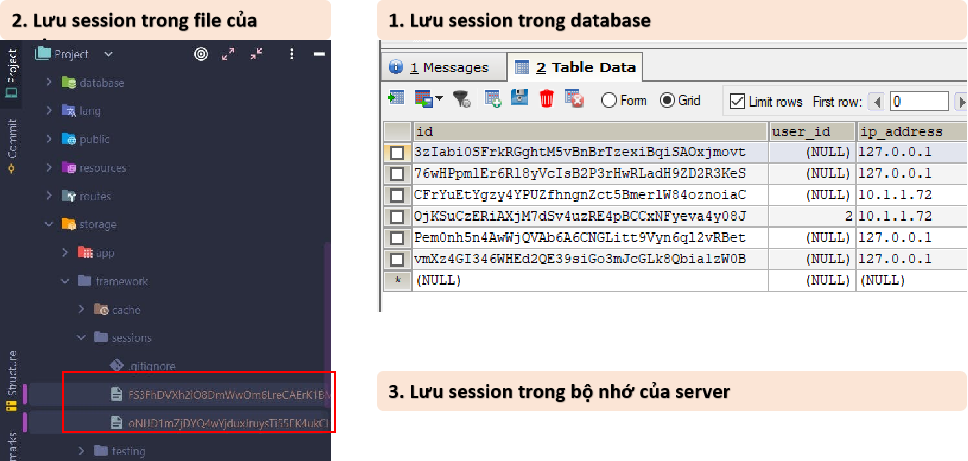
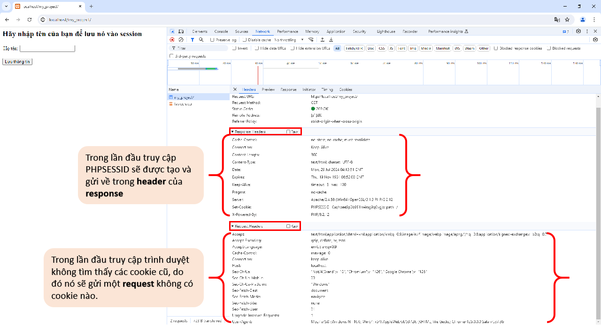
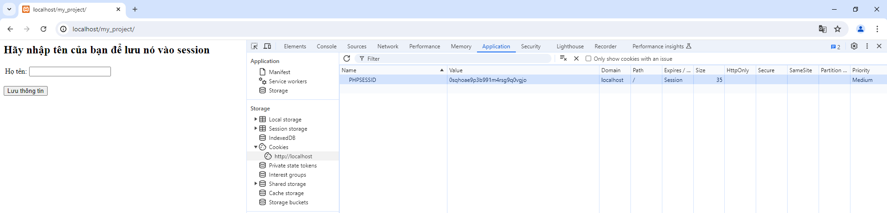
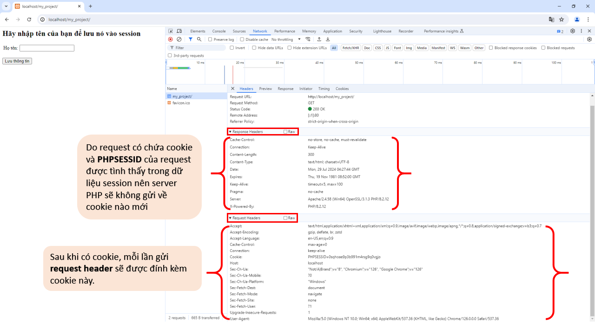
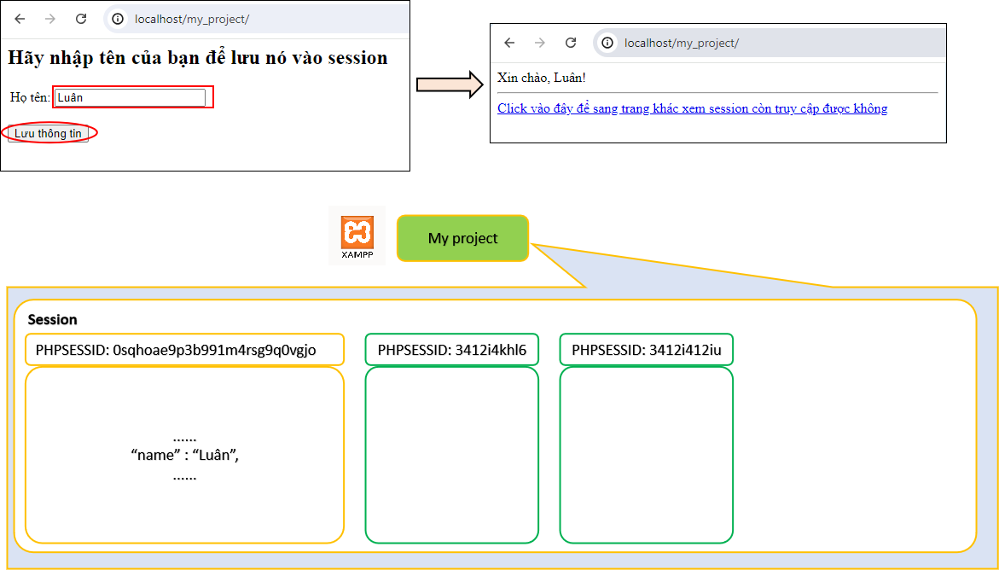

### **What is a Session?** (Session là gì?)

Session là một phiên làm việc giữa một người dùng và một server web. Nó được tạo ra khi một người dùng truy cập vào một website và kết thúc khi người dùng đóng trình duyệt hoặc sau một khoảng thời gian không hoạt động.

**Why do we use Sessions?** (Tại sao chúng ta sử dụng Session?)

- **Duy trì trạng thái người dùng xuyên suốt các trang:** Session giúp lưu trữ thông tin người dùng trong suốt quá trình họ tương tác với website, từ trang này sang trang khác. Ví dụ: khi bạn đăng nhập vào một trang web bán hàng, thông tin đăng nhập của bạn sẽ được lưu trong session để bạn có thể xem giỏ hàng, quản lý tài khoản mà không cần đăng nhập lại.

- **Tạo các ứng dụng web động:** Session cho phép chúng ta xây dựng các ứng dụng web có tính tương tác cao, nơi người dùng có thể thực hiện các hành động và nhận được phản hồi ngay lập tức. **Ví dụ:** Các ứng dụng chat trực tuyến, các trò chơi trực tuyến đều sử dụng session để lưu trữ thông tin trạng thái của người chơi trong quá trình chơi.

- **Bảo mật:** Session thường được sử dụng để xác thực người dùng và bảo vệ các thông tin nhạy cảm.

- **Phân biệt các yêu cầu từ cùng một người dùng:** Session giúp phân biệt các yêu cầu được gửi từ cùng một trình duyệt trong một khoảng thời gian nhất định. Điều này rất quan trọng cho các ứng dụng web có nhiều người dùng đồng thời.

**Tại sao không sử dụng phương pháp khác?**

- **Cookie:**

  - **Giới hạn kích thước:** Cookie có kích thước nhỏ, không phù hợp để lưu trữ các dữ liệu lớn hoặc phức tạp.
  - **Bảo mật:** Cookie có thể bị giả mạo hoặc đánh cắp.
  - **Không phù hợp cho các dữ liệu nhạy cảm:** Vì cookie được lưu trữ trên máy khách, nên không nên sử dụng cookie để lưu trữ các thông tin mật khẩu hoặc thông tin tài khoản.

- **URL parameters:**

  - **Không an toàn:** Dữ liệu được truyền qua URL có thể bị nhìn thấy và dễ bị tấn công.
  - **Giới hạn kích thước:** URL có độ dài giới hạn.
  - **Khó quản lý:** Khi có nhiều tham số được truyền qua URL, nó sẽ làm cho URL trở nên rất dài và khó đọc.

- **Lưu trữ thông tin người dùng tạm thời:** Giỏ hàng, thông tin đăng nhập, tùy chọn cá nhân hóa,...
- **Theo dõi hành vi người dùng trong một phiên:** Để cung cấp trải nghiệm người dùng tốt hơn, ví dụ như đề xuất sản phẩm liên quan.
- **Bảo mật:**
- **When do we use Sessions?** (Khi nào chúng ta sử dụng Session?)

- Khi cần lưu trữ thông tin người dùng trong một phiên làm việc.
- Khi cần theo dõi hành vi người dùng trong thời gian thực.
- Khi muốn tạo các tính năng như giỏ hàng, bảng điều khiển người dùng.
- Khi muốn xác thực người dùng và bảo vệ các thông tin nhạy cảm.
- Nhiều trường hợp khác.

### **Where is Session data stored?** (Dữ liệu Session được lưu trữ ở đâu?)

- **Server-side:** Dữ liệu Session thường được lưu trữ trên server web, trong bộ nhớ (RAM), trong file của project hoặc trong cơ sở dữ liệu tùy vào vị trí mà lập trình viên muốn.


### **Who can access Session data?** (Ai có thể truy cập dữ liệu Session?)

- **Server web:** server web có quyền truy cập đầy đủ vào dữ liệu Session của người dùng.
- **Ứng dụng web:** Các ứng dụng web chạy trên server cũng có thể truy cập dữ liệu Session.
- **Người dùng:** Thông thường người dùng không thể trực tiếp truy cập và xem dữ liệu Session.

### **How does a Session work?** (Session hoạt động như thế nào?)

1. Khi người dùng truy cập website, server tạo ra một Session ID (trong PHP nó có tên là `PHPSESSID` ) duy nhất và gửi nó đến trình duyệt của người dùng dưới dạng cookie.
2. Trình duyệt sẽ gửi Session ID trở lại server trong mỗi yêu cầu tiếp theo.
3. Server sử dụng Session ID để tìm kiếm và truy xuất dữ liệu Session tương ứng.
4. `$_SESSION` trong PHP là mảng chứa tất cả thông tin session tương ứng với Session ID mà người dùng gửi lên.

### **So sánh Session và Cookie:**

| Tính năng        | Session                                             | Cookie                                  |
| ---------------- | --------------------------------------------------- | --------------------------------------- |
| Vị trí lưu trữ   | Server-side                                         | Client-side                             |
| Thời gian sống   | Kết thúc phiên làm việc                             | Có thể thiết lập thời gian hết hạn      |
| Bảo mật          | An toàn hơn cookie                                  | Ít an toàn hơn session                  |
| Mục đích sử dụng | Lưu trữ thông tin tạm thời trong một phiên làm việc | Lưu trữ thông tin lâu dài hoặc ngắn hạn |

- **Khởi tạo và sử dụng session:** Dùng hàm `session_start()` hoặc `ob_start()` để thông báo việc bạn sẽ sử dụng session. Sử dụng cú pháp `$_SESSION[key] = value` để gắng giá trị tương ứng với 1 key trong session.
- **Kiểm tra xem session đã tồn tại chưa:** sử dụng `isset($_SESSION[key])` để kiểm tra xem trong session có index nào tên là `key` không.

> Xem ví dụ dưới đây

```php
// file: index.php
<?php
  session_start();
  // Trong trường hợp có dữ liệu từ form thì cập nhật session
  if ($_SERVER["REQUEST_METHOD"] == "POST") {
    $_SESSION['name'] = $_POST["username"];
  }
  // Hiển thị tên người dùng nếu có session
  if (isset($_SESSION['name'])) {
    // Truy xuất dữ liệu từ session
    echo "Xin chào, " . $_SESSION['name'] . "! <hr>";
    echo '<a href="session-check.php">Click vào đây để sang trang khác xem session còn truy cập được không</a>';
  }
?>


<?php 
// Hiển thị form nhập dữ liệu nếu chưa có session
if (!isset($_SESSION['name'])) { 
?>
<h2>Hãy nhập tên của bạn để lưu nó vào session</h2>
<form method="post">
    <table>
      <tr>
          <td>Họ tên:</td>
          <td><input type="text" name="username"></td>
      </tr>
    </table>
    <br>
    <button type="text" name="name">Lưu thông tin</button>
</form>
<?php } ?>
```

```php
// file: session-check.php
<?php
  session_start();
  // Hiển thị tên người dùng nếu có session
  if (isset($_SESSION['name'])) {
    // Truy xuất dữ liệu từ session
    echo "Xin chào, session username của bạn đã được tìm thấy mà không cần nhập lại >> <b>" . $_SESSION['name'] . "<b>!";
  }
?>
```
> Cách session hoạt động ở ví dụ này
Ở lần đầu truy cập, trình duyệt của bạn không có sẵn `PHPSESSID` do đó trong request truyền đi sẽ không có cookie nào, server PHP sau khi nhận được request sẽ hiểu rằng đây là lần truy cập đầu tiên của bạn, do đó nó sẽ tạo một vị trí lưu session cho bạn với `PHPSESSID` mới. Sau khi tạo xong `PHPSESSID` mới sẽ được gửi trong header của response về trình duyệt.

Sau khi nhận được cookie từ response gửi về trình duyệt sẽ lưu nó lại và gửi đi kèm theo cookie này trong header ở những lần gửi request sau đó.

Nếu ấn `F5` hoặc ấn nút refresh để load lại trang lúc này bạn sẽ thấy trong các request gửi đi có cookie đã lưu.

Do chưa nhập dữ liệu vào ô input `Họ tên` nên lúc này form vẫn sẽ hiển thị vì session đã có nhưng `$_SESSION['name']` thì đang rỗng. Nhập tên của bạn và nhấn `Lưu thông tin`. Sau khi lưu `$_SESSION['name']` sẽ có giá trị do đó sẽ trả về tên của bạn. Lúc này có thể hình dùng rằng, trong dự án của bạn, khu vực lưu trữ session tương ứng với `PHPSESSID` đã có thêm dữ liệu `name=Luân`. Lúc này HTML trả về đã có nội dung tên của bạn. Nếu refresh nhiều lần thì thông tin vẫn sẽ không thay đổi do nó đã được lưu trong session và chỉ lấy ra để trả về.
!


- **Hủy session:** Dùng hàm `session_destroy()` để hủy toàn bộ session của một người dùng hoặc dùng hàm `unset()`, VD: `unset($_SESSION['id_login'])` để hủy một phần session.

```php
<?php
session_start();

// Hủy toàn bộ session
session_destroy();
?>
```

- **Thiết lập thời gian sống của session:** Dùng hàm `ini_set()`. Sau khi hết thời hạn session tương ứng với `PHPSESSID` sẽ bị hủy. Từ lần truy cập tiếp theo bạn sẽ được cập một `PHPSESSID` mới.

```php
<?php
// Thiết lập thời gian sống của session là 30 phút (1800 giây)
ini_set('session.gc_maxlifetime', 1800);

session_start();

// ...
?>
```

> Ví dụ về giỏ hàng

```php
<?php
session_start();

// Thêm sản phẩm vào giỏ hàng
if (isset($_POST['add_to_cart'])) {
    $product_id = $_POST['product_id'];
    // ... kiểm tra sản phẩm tồn tại ...
    if (!isset($_SESSION['cart'][$product_id])) {
        $_SESSION['cart'][$product_id] = 1;
    } else {
        $_SESSION['cart'][$product_id]++;
    }
}

// Hiển thị giỏ hàng
if (isset($_SESSION['cart'])) {
    foreach ($_SESSION['cart'] as $product_id => $quantity) {
        // ... lấy thông tin sản phẩm từ cơ sở dữ liệu ...
        echo "$quantity x $product_name";
    }
}
?>
```