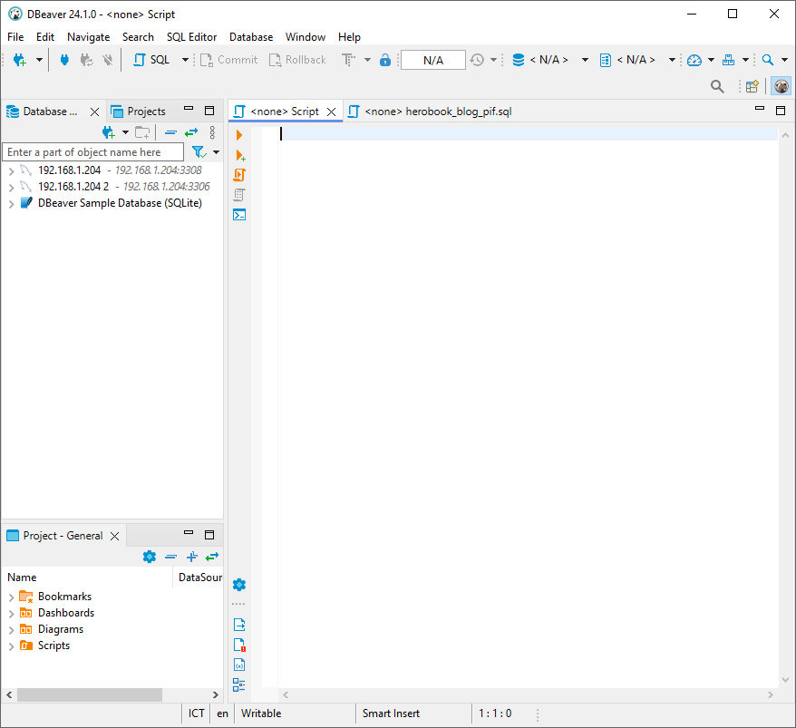
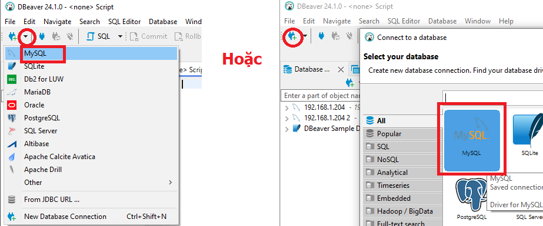
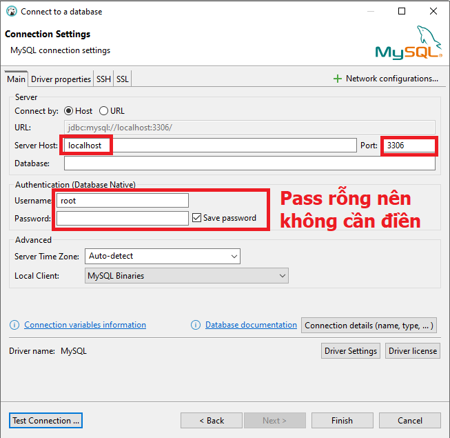
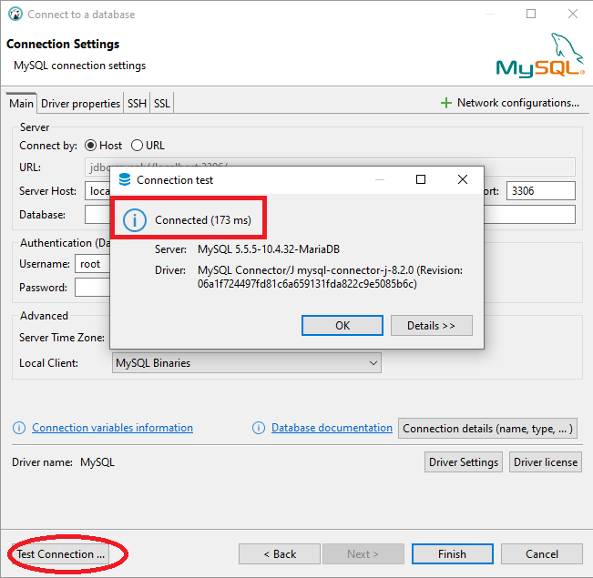

### Chuẩn bị:

- `DBeaver:` Tải và cài đặt DBeaver từ trang web chính thức: [https://dbeaver.io/download/](https://dbeaver.io/download/)
- `Thông tin kết nối MySQL:` Bạn cần có các thông tin sau:
    - `Hostname:` Địa chỉ máy chủ MySQL (thường là `localhost` nếu MySQL được cài đặt trên máy của bạn)
    - `Port:` Cổng kết nối (thường là 3306)
    - `Database:` Tên cơ sở dữ liệu bạn muốn kết nối
    - `Username:` Tên người dùng MySQL
    - `Password:` Mật khẩu của người dùng MySQL

### Các bước thực hiện:

1. `Mở DBeaver:` Khởi động ứng dụng DBeaver.

1. `Tạo kết nối mới:`
    - `Cách 1:` Nhấp vào biểu tượng "+" ở góc trên bên trái và chọn "Database Connection".
    - `Cách 2:` Vào menu "Database" và chọn "New Connection".
1. `Chọn loại cơ sở dữ liệu:` Trong cửa sổ "New Database Connection", chọn "MySQL" và nhấp "Next".

1. `Điền thông tin kết nối:`
    - `Driver:` Chọn driver MySQL (thường là MySQL Connector/J)
    - `Host:` Nhập địa chỉ hostname của máy chủ MySQL
    - `Port:` Nhập cổng kết nối (thường là 3306)
    - `Database:` Nhập tên cơ sở dữ liệu
    - `User:` Nhập tên người dùng
    - `Password:` Nhập mật khẩu
    - `Name:` Đặt tên cho kết nối này để dễ nhận biết (tùy chọn)

1. `Test Connection:` Nhấp vào nút "Test Connection" để kiểm tra xem thông tin kết nối có chính xác không. Nếu thành công, bạn sẽ thấy thông báo "Connection successful".

1. `Save and Finish:` Nhấp vào "Finish" để lưu kết nối.

`Sau khi hoàn thành các bước trên, bạn sẽ thấy kết nối mới được thêm vào danh sách các kết nối trong DBeaver. Bạn có thể nhấp đúp vào kết nối đó để mở và bắt đầu làm việc với cơ sở dữ liệu MySQL của mình.`
