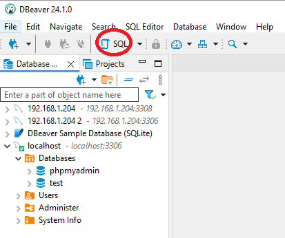
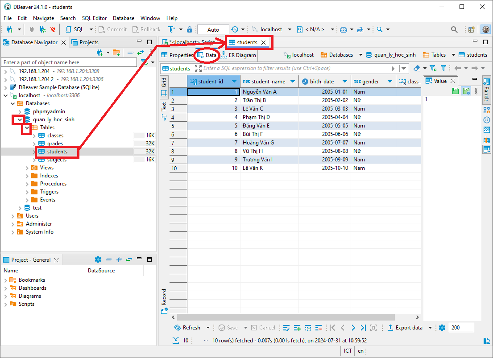

Tạo mới database sau cho buổi thực hành của bạn

- `Thông tin sinh viên:` Mã sinh viên, họ tên, ngày sinh, giới tính, lớp, điểm trung bình...
- `Thông tin lớp học:` Mã lớp, tên lớp, giáo viên chủ nhiệm...
- `Thông tin môn học:` Mã môn học, tên môn học, số tín chỉ...
- `Kết quả học tập:` Mã sinh viên, mã môn học, điểm thi...

Tạo một cơ sở dữ liệu với 4 bảng: `students`, `classes`, `grades` và `subjects`.

Đầu tiên bạn chọn nút để mở màn hình nhập script sql:


Sau khi tạo xong bạn kiểm tra lại script xem chọn đúng cơ sở dữ liệu localhost chưa, nếu chưa thì hãy chọn lại, sau khi chọn script dưới đây dán vào:


```sql
CREATE DATABASE quan_ly_hoc_sinh;
USE quan_ly_hoc_sinh;

CREATE TABLE classes (
    class_id INT PRIMARY KEY AUTO_INCREMENT,
    class_name VARCHAR(50),
    teacher_name VARCHAR(100)
);

CREATE TABLE students (
    student_id INT PRIMARY KEY AUTO_INCREMENT,
    student_name VARCHAR(100),
    birth_date DATE,
    gender ENUM('Nam', 'Nữ'),
    class_id INT,
    FOREIGN KEY (class_id) REFERENCES classes(class_id)
);
```

`Giải thích:`

- `students`: Lưu trữ thông tin sinh viên.
- `classes`: Lưu trữ thông tin lớp học.
- `grades`: Lưu trữ điểm số của sinh viên.
- `subjects`: Lưu trữ thông tin môn học.

- `PRIMARY KEY:` Xác định khóa chính của mỗi bảng, đảm bảo tính duy nhất của mỗi bản ghi.
- `FOREIGN KEY:` Tạo mối quan hệ giữa các bảng, ví dụ: `student_id` trong bảng `grades` tham chiếu đến `student_id` trong bảng `students`.

> `Lưu ý:` Bạn có thể tùy chỉnh các kiểu dữ liệu, độ dài trường và các ràng buộc khác tùy theo yêu cầu của bạn.

Sau khi dán xong bạn ấn nút chạy toàn bộ script để tạo tạo cơ sử dữ liệu mới `quan_ly_hoc_sinh`


Chạy script sau để có dữ liệu mẫu:


```sql

INSERT INTO classes (class_id, class_name, teacher_name)
VALUES
  (1, '10A', 'Nguyễn Văn Tèo'),
  (2, '10B', 'Trần Thị Mai');

INSERT INTO students (student_id, student_name, birth_date, gender, class_id)
VALUES
  (1, 'Nguyễn Văn A', '2005-01-01', 'Nam', 1),
  (2, 'Trần Thị B', '2005-02-02', 'Nữ', 1),
  (3, 'Lê Văn C', '2005-03-03', 'Nam', 1),
  (4, 'Phạm Thị D', '2005-04-04', 'Nữ', 1),
  (5, 'Đặng Văn E', '2005-05-05', 'Nam', 1),
  (6, 'Bùi Thị F', '2005-06-06', 'Nữ', 2),
  (7, 'Hoàng Văn G', '2005-07-07', 'Nam', 2),
  (8, 'Vũ Thị H', '2005-08-08', 'Nữ', 2),
  (9, 'Trương Văn I', '2005-09-09', 'Nam', 2),
  (10, 'Lê Văn K', '2005-10-10', 'Nam', 2);
```

Sau khi chạy xong bạn refresh lại lần nửa và mở bản bất kỳ để kiểm tra data.

