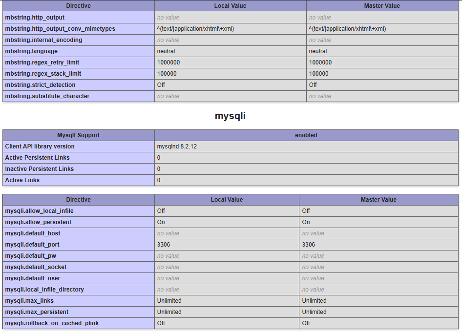

> Để kết nối MySql với PHP trước tiên bạn cần kiểm tra xem PHP có cài đặt sẵn mysqli hỗ trợ kết nối MySql hay chưa bằng hàm `phpinfo()`. Nếu bạn sử dụng xampp thì chúng thường được cài đặt sẵn.

```php
phpinfo(); // Mở website và kiểm tra
```



### Kết nối PHP với MySQL

Thử chạy đoạn code sau và xem kết quả, nếu `Connection to database is successful` được hiển thị thì tức là bạn đã connect thành công:

```php
<?php
$host = "localhost:3306";
$username = "root";
$password = "";
$conn = mysqli_connect($host, $username, $password);
if (!$conn) {
    die("Could not connect to database: Please verify the privileges" . mysqli_error());
}
echo "Connection to database is successful";
mysqli_close($conn); // hoặc $conn->close();
```

> Giải thích các hàm trong đoạn code PHP

> Chi tiết các hàm

- `$host = "localhost:3306";`: Gán địa chỉ máy chủ MySQL cho biến `$host`. Trong trường hợp này, nó là `localhost:3306`, nghĩa là máy chủ MySQL đang chạy trên cùng máy và cổng mặc định là 3306.
- `$username = "root";`: Gán tên người dùng MySQL cho biến `$username`.
- `$password = "root";`: Gán mật khẩu của người dùng MySQL cho biến `$password`.
- `$conn = mysqli_connect($host, $username, $password);`: Hàm `mysqli_connect()` được sử dụng để tạo một kết nối đến cơ sở dữ liệu MySQL. Nó trả về một đối tượng kết nối được gán cho biến `$conn`. Các tham số của hàm là địa chỉ máy chủ, tên người dùng và mật khẩu.
- `if (!$conn) { ... }`: Kiểm tra xem kết nối có thành công không. Nếu không thành công, tức là `$conn` có giá trị là `false`, thì sẽ hiển thị thông báo lỗi và dừng chương trình.
- `die("Could not connect to database: Please verify the privileges" . mysqli_error());`: Nếu kết nối thất bại, hàm `die()` sẽ dừng chương trình và hiển thị thông báo lỗi. Hàm `mysqli_error()` trả về thông báo lỗi cụ thể từ MySQL.
- `echo "Connection to database is successful";`: Nếu kết nối thành công, in ra thông báo "Connection to database is successful".
- `mysqli_close($conn);`: Đóng kết nối đến cơ sở dữ liệu sau khi sử dụng xong.

### Thao tác với cơ sở dữ liệu

#### `Tạo mới`

```php
<?php
$host = "localhost:3306";
$username = "root";
$password = "";
$conn = mysqli_connect($host, $username, $password);
if (!$conn) {
    die("Could not connect to database: Please verify the privileges" . mysqli_error());
}
// Tạo mới database
$sql = "CREATE DATABASE sampleDB";
if ($conn->query($sql) === TRUE) {
    echo "Bạn đã tạo xong DB, hãy kiểm tra lại";
} else {
    echo "Có lỗi trong quá trình tọa mới DB: " . $conn->error;
}
mysqli_close($conn);

```

Nếu bạn tạo 1 lần đầu, sẽ có thông báo thành công, sau đó chạy lần nửa sẽ thấy thông báo thất bại (bởi vì bị trùng database name với database mới tạo ở lần đầu).

> Giải thích các hàm trong đoạn code PHP

- `$sql = "CREATE DATABASE sampleDB";`: Tạo một chuỗi SQL với câu lệnh `CREATE DATABASE sampleDB` để tạo một cơ sở dữ liệu có tên là "sampleDB".
- `if ($conn->query($sql) === TRUE) { ... }`: Thực hiện câu lệnh SQL bằng phương thức `query()` của đối tượng kết nối `$conn`. Nếu câu lệnh thực thi thành công, điều kiện `if` sẽ đúng.
  - `$conn->query($sql)`: Thực thi câu lệnh SQL được lưu trong biến `$sql`. Phương thức `query()` trả về `TRUE` nếu thành công, hoặc một đối tượng `mysqli_result` nếu câu lệnh trả về một kết quả (ví dụ: SELECT).
  - `=== TRUE`: So sánh chặt chẽ để đảm bảo kết quả là đúng (TRUE) và không phải một đối tượng `mysqli_result`.
- `echo "Bạn đã tạo xong DB, hãy kiểm tra lại";`: Nếu câu lệnh SQL thành công, in ra thông báo "Task complete. You have successfully created a database".
- `else { ... }`: Nếu câu lệnh SQL không thành công, điều kiện `else` sẽ được thực hiện.
  - `echo "You have an error while creating database: " . $conn->error;`: In ra thông báo lỗi kèm theo thông tin lỗi từ đối tượng kết nối `$conn`.

#### `Xóa`

```php
<?php
$host = "localhost:3306";
$username = "root";
$password = "";
$conn = mysqli_connect($host, $username, $password);
if (!$conn) {
    die("Could not connect to database: Please verify the privileges" . mysqli_error());
}
$sql = "DROP DATABASE sampleDB";
$retval = mysqli_query($conn, $sql);
if (!$retval) {
    die("Gặp lỗi khi xóa database: " . mysqli_error());
}
echo " Xóa database thành công, hãy kiểm tra lại.";
mysqli_close($conn);
```

Nếu bạn xóa 1 lần đầu, sẽ có thông báo thành công, sau đó chạy lần nửa sẽ thấy thông báo thất bại (bởi vì không còn database để xóa do nó đã xóa ở lần trước đó).

> Giải thích các hàm trong đoạn code PHP

- `$sql = "DROP DATABASE sampleDB";`:

  - Tạo một chuỗi SQL với câu lệnh `DROP DATABASE sampleDB` để xóa cơ sở dữ liệu có tên "sampleDB".

- `$retval = mysqli_query($conn, $sql);`:

  - Thực thi câu lệnh SQL bằng hàm `mysqli_query()`. Kết quả của việc thực thi được gán cho biến `$retval`.
  - Hàm `mysqli_query()` trả về `TRUE` nếu câu lệnh thành công, hoặc `FALSE` nếu có lỗi.

- `if (!$retval) { ... }`:

  - Kiểm tra nếu `$retval` bằng `FALSE`, tức là câu lệnh SQL không thành công.
  - Nếu điều kiện đúng, sẽ thực hiện khối lệnh bên trong.

- `die("Gặp lỗi khi xóa database: " . mysqli_error());`:

  - In ra thông báo lỗi và dừng chương trình. Hàm `mysqli_error()` trả về thông báo lỗi cụ thể từ MySQL.

- `echo " Xóa database thành công, hãy kiểm tra lại.";`:
  - Nếu câu lệnh SQL thành công, in ra thông báo xác nhận việc xóa cơ sở dữ liệu.

#### `Hiển thị, thêm, sữa, xóa, dữ liệu`

> Giới thiệu: Chúng ta sẽ xây dựng một ứng dụng đơn giản để quản lý thông tin sinh viên dựa trên bảng `students` mà bạn đã cung cấp. Ứng dụng này sẽ bao gồm các chức năng cơ bản như:

- `Hiển thị danh sách sinh viên:` Hiển thị toàn bộ hoặc một phần danh sách sinh viên từ cơ sở dữ liệu.
- `Tìm kiếm sinh viên:` Tìm kiếm sinh viên theo các tiêu chí như tên, ngày sinh, giới tính, lớp.
- `Thêm mới sinh viên:` Cho phép người dùng nhập thông tin để thêm một sinh viên mới vào cơ sở dữ liệu.
- `Sửa thông tin sinh viên:` Cho phép người dùng chỉnh sửa thông tin của một sinh viên đã tồn tại.
- `Xóa sinh viên:` Cho phép người dùng xóa một sinh viên khỏi cơ sở dữ liệu.

##### Cấu trúc ứng dụng

Để thực hiện các chức năng trên, chúng ta sẽ cần các file sau:

- `index.php:` Trang hiển thị danh sách sinh viên, form tìm kiếm và các liên kết đến các chức năng khác.
- `add_student.php:` Form để thêm mới sinh viên.
- `edit_student.php:` Form để sửa thông tin sinh viên.
- `delete_student.php:` Xử lý việc xóa sinh viên.
- `search_student.php:` Xử lý việc tìm kiếm sinh viên.

`Mã nguồn ví dụ`:

`index.php`: Hiển thị và tìm kiếm sinh viên.

> Theo dõi file đính kèm

> Hàm `mysqli_fetch_assoc()` sẽ tìm và trả về một dòng kết quả của một truy vấn MySQL nào đó dưới dạng một mảng kết hợp.

`add_student.php`: Thêm một sinh viên vào danh sách sinh viên.

> Theo dõi file đính kèm

`edit_student.php`: Sửa thông tin một sinh viên.

> Theo dõi file đính kèm

`delete_student.php`: Xóa thông tin sinh viên.

> Theo dõi file đính kèm
