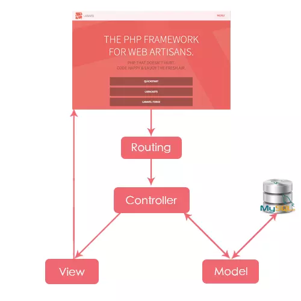

## Laravel

### Laravel là gì?

Laravel là một framework PHP mã nguồn mở, được thiết kế để giúp các nhà phát triển xây dựng các ứng dụng web một cách nhanh chóng, an toàn và hiệu quả. Nó cung cấp một cấu trúc vững chắc, một hệ sinh thái lớn các gói phần mềm và một cộng đồng người dùng sôi động.

### Lý do khiến Laravel nổi tiếng?

Lý do đầu tiên khiến Laravel nhanh chóng được cộng đồng đón nhận và sử dụng nhiều là do nó rất dễ để có thể sử dụng. Ngay cả khi bạn chỉ mới chỉ có những kiến thức cơ bản nhất về lập trình web với PHP thì việc bắt đầu sử dụng Laravel cũng chỉ mất vài giờ là bạn có thể bắt tay vào việc làm một project nhỏ.
Document mà Laravel cung cấp trên trang chủ của mình được viết rất rõ ràng và dể hiểu giúp cho bạn nhanh chóng có thể tìm được những gì mình muốn.

Trang chính thức của Laravel: https://laravel.com/docs/11.x

### Laravel xây dựng theo mô hình MVC

Laravel được xây dựng và phát triển theo mô hình MVC (Model-View-Controller) nhờ đó mà cấu trúc và cách tổ chức code trong project được sắp xếp một cách hợp lý dễ dàng cho việc maintain cũng như phát triển về lâu dài.



### Ưu điểm của Laravel

Laravel sở hữu rất nhiều mặt ưu điểm để thu hút các nhà lập trình chắc chắn không thể bỏ qua như :

- Việc dùng Laravel 5 sẽ hỗ trợ các lập trình viên có thể tiếp cận đến các tính năng mới nhất mà PHP cung cấp
- Nguồn tài nguyên tài liệu sẵn có vô cùng đa dạng và phong phú, thân thiện với các lập trình viên
- Tốc độ xử lý dữ liệu nhanh chóng: Laravel hỗ trợ tối đã trong việc thiết lập trang web hay các dự án lớn trong vòng thời gian ngắn hạn.
- Dễ sử dụng: Cho dù kiến thức PHP của bạn có hạn hẹp đi chăng nữa thì bạn vẫn có thể phát triển website một cách nhanh chóng
- Di chuyển Database dễ dàng : Laravel cho phép bạn duy trì cấu trúc cơ sở dữ liệu mà không cần phải tạo lại. Thay vì sử dụng SQL, bạn có thể dùng PHP để kiểm soát dữ liệu. Bên cạnh đó, bạ cũng có thể khôi phục được những thay đổi gần nhất của Database.
- Tính năng bảo mật cao: Laravel sử dụng PDO nhằm để chống lại sự tấn công SQL Injection, cộng với field token ẩn để chống lại tấn công kiểu CSRF. Điều này sẽ giúp cho người dùng có thể hoàn toàn tập trung vào việc phát triển sản phẩm.

Cài đặt Laravel thông qua Composer:

```shell
composer create-project laravel/laravel ten_du_an
```
